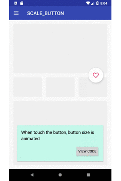

# AnimationShowcase

This is showcase app of Transition Animation
Current contents is:
- ObjectAnimator(Scale)
- Arc Motion Transition
- Shared element Activity Transition
- State list animation
- Shared element re-ordering animation
- Selectable item background samples
- Crop to outline

You can refer link with `View Code` button

